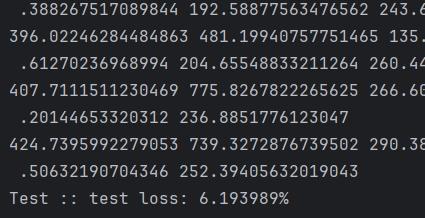
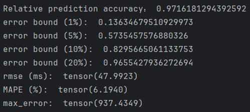

# GCoDE-Predictor


> **Note:**  
> Citation information will be **updated in the near future**.
> We welcome your **use** and **citation** of this work.


### Overview

This repository provides the implementation of the **system performance predictor** module from our work:  
**"GCoDE: Efficient Device–Edge Co-Inference for GNNs via Architecture–Mapping Co-Search"** (submitted to *IEEE Transactions on Computers*).  
It is designed for estimating **co-inference latency** and **on-device energy consumption** in GNN device–edge co-inference scenarios.

This repository provides:

- **Latency dataset** collected in our paper (about 9000 GNN architectures) for reproducing experiments.  
- **Pre-trained predictor model parameters** and test results for the provided dataset.  
- **Scripts** for data preprocessing, LUT construction, predictor testing, and detailed accuracy analysis.  
- **Example usage** for testing the predictor, including evaluation log outputs for further analysis.  


---

### Repository Structure
```
├── dataset/        # Collected datasets for predictor training/testing
├── LUT/            # Lookup tables of measured GNN operation latency and power
├── Model/          # Predictor model architectures
├── process/        # Data preprocessing and PyG graph construction scripts
├── predictor_test/          # testing scripts for the predictor
├── util.py         # Utility functions used by the predictor and dataset construction
```
---

### Requirements
- Python ≥ 3.8
- PyTorch ≥ 1.11
- PyG ≥ 2.1
- numpy

---

### Usage

#### 1. Dataset Preparation Guidelines
The dataset preparation process consists of two major stages: **LUT Construction** and **Training Dataset Construction**.

Quick Start:
1. Build LUT by measuring op-level latency/power (see LUT Construction).
2. Generate candidate architectures & measure system-level performance.
3. Process raw data into PyG dataset format.

---
##### A. LUT Construction

The Lookup Table (LUT) stores operation-level latency or power measurements for GNN operators on specific devices.  
It is built in two steps:

1. **Operation Data Measurement**
    - Select all GNN operations used in the target search/design space (e.g., KNN, Combine, pooling, aggregate).
    - For each operation and each `(in_dim, out_dim)` pair:
        - Perform **multiple independent measurements** under identical hardware/software settings.
        - Measure both **latency** (ms) and/or **power consumption** (W), depending on the LUT type.
    - Store results in TXT files with the following format:
         ```
         operation_name,in_dim,out_dim,value
         ```
      where:
        - `operation_name`: Name of the GNN operation.
        - `in_dim`: Input feature dimension.
        - `out_dim`: Output feature dimension.
        - `value`: Measured latency (ms) or power (W).

      **Example (latency LUT raw file):**
         ```
         aggregate,3,6,0.22633870442708334
         aggregate,6,12,0.27776615960257395
         aggregate,12,24,0.43201446533203125
         aggregate,24,48,0.7267793019612631
         ```


##### B. Training Dataset Construction

The training dataset contains graph-structured samples representing complete GNN architectures and their measured performance. It is built in three steps:

1. **Sample Generation**
    - In our paper, we generate candidate samples by **randomly sampling 12 positions in the supernet with different operation types**, resulting in diverse GNN architectures.
    - Users can also define their own sampling strategies to adapt to specific tasks and requirements.

2. **Sample Performance Measurement**
    - Deploy the generated samples to the actual device–edge co-inference system.
    - Evaluate the same performance metrics as in our experiments (e.g., end-to-end latency, on-device energy consumption).
    - **Recommendation:** Perform multiple independent measurements for each sample, remove outliers, and average the remaining results to reduce measurement noise.
    - Store the collected results in a TXT file, where **each line represents one sample** in the following format:
      ```
      arch_encoding: measured_value
      ```
        - `arch_encoding`: Encoded architecture, where the first part encodes layer operation types and the second part encodes dimensions.
        - `measured_value`: The measured performance value (e.g., latency in ms).

      **Example (latency measurements):**
      ```
      1 5 3 2 3 2 1 2 0 2 2 4,2 0 0 6 0 6 4 6 0 6 6 3: 584.7791194915771 ms
      3 0 5 0 1 0 1 2 0 2 2 4,0 0 0 0 2 0 4 6 0 6 6 3: 491.52429898579913 ms
      1 0 0 1 3 2 1 2 5 1 0 4,2 0 0 2 0 6 4 6 0 4 0 3: 643.3402895927429 ms
      1 5 1 0 3 0 2 0 1 0 4 1,2 0 2 0 0 0 6 0 4 0 3 4: 57.86557197570801 ms
      ```

3. **Data Cleaning and PyG Dataset Construction**
    - Run `process/sample_clean.py` to clean the collected sample data by:
        - Removing duplicates
        - Converting raw TXT files into a structured format
    - Then use `process/latency_mn.py` or `process/energy_mn.py` to generate datasets in **PyTorch Geometric (PyG)** format.
    - **Important:** Update the `main` function in these scripts to set the input file name to the cleaned data file generated in the previous step.

---

#### 2. Test Our Predictor

**Provided dataset and pre-trained model**  

- In the `dataset/` directory, we provide the latency dataset collected in our paper (about **9000** GNN architectures) as an example, named **`mn_pi_i7_40Mbps`**.  
- This dataset was collected on the **ModelNet40** dataset under a **40 Mbps** network, using a **Raspberry Pi + Intel i7 CPU** device–edge setup.  
- In the `predictor_test/outputs/` directory, we also provide the trained model parameters and test results on this dataset. 
- Users can directly use the provided dataset and model to reproduce the results reported in our paper without re-training.

---

**Testing the predictor**  

If you want to reproduce the experiment results in our paper using the provided dataset and trained model, run the `test.py` script:

```bash
python test.py \
    --exp_name pi_i7_mn40_40Mbps \
    --dataset_name mn_pi_i7_40Mbps \
    --model pi_i7_mn40_40Mbps \
    --error_bound \
    --norm
    
```
- `--error_bound` : # Save both ground truth and predicted values to a file, and calculate accuracy within a given error bound.
- `--norm` : # # Apply z-score normalization to input features.

- This script will print the MAPE on the test set and save detailed predictions in `outputs/pi_i7_mn40_40Mbps/eval.log`.  
- The log file contains the ground truth and predicted values for each sample, which can be used for further analysis.  

**Example output:**  


---

**Detailed accuracy analysis**  

To perform a detailed accuracy analysis on the predictor, use the `accuracy_test.py` script:

```bash
python accuracy_test.py \
    --exp_name pi_i7_mn40_40Mbps
```

- This script provides a more fine-grained evaluation of prediction accuracy.  

**Example output:**  



